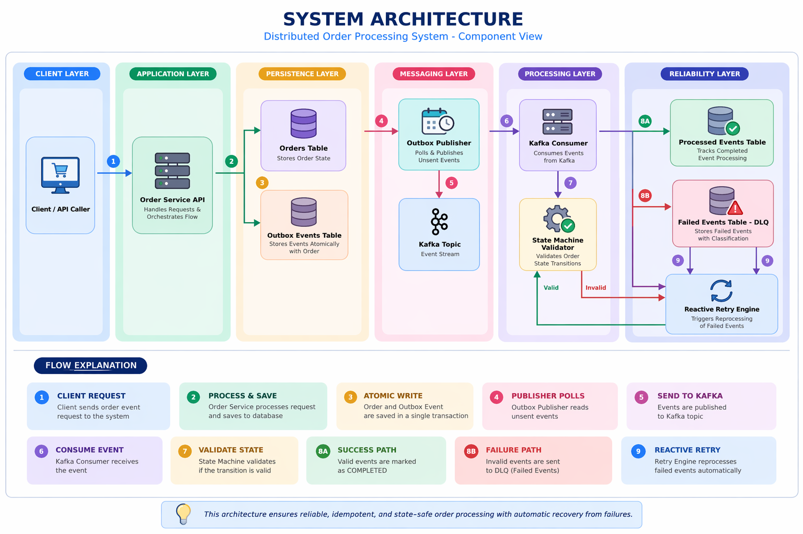

# 🚀 Distributed Order Processing System

> A fault-tolerant, event-driven system built to handle ordering guarantees, idempotency, and failure recovery in distributed environments.

---

## 🧭 System Overview

This system is designed to ensure:

* ✅ Reliable event delivery
* ✅ Idempotent processing
* ✅ State-safe transitions
* ✅ Automatic recovery from failures
* ✅ Handling of out-of-order events

---

## 🏗️ System Architecture



> 📌 End-to-end flow from API → Outbox → Kafka → Consumer → DLQ → Reactive Retry

---

## 🔁 End-to-End Flow

### 1. Event Creation (Write Phase)

* API receives request
* Order is persisted
* Outbox event is created
* Both operations happen in a **single database transaction**

---

### 2. Outbox Publishing

* Publisher polls `outbox_events` table
* Publishes events to Kafka
* Marks events as `SENT`

---

### 3. Event Consumption

* Kafka consumer reads events
* Checks idempotency (`processed_events`)
* Validates using state machine

---

### 4. Processing Outcome

* ✅ Valid → Marked `COMPLETED` in `processed_events`
* ❌ Invalid → Stored in `failed_events` (DLQ)

---

### 5. Reactive Retry

* Triggered after successful processing
* Fetches failed events by `order_id`
* Re-evaluates and retries them

---

## ⚠️ Out-of-Order Handling

**Scenario:**

```text
SHIPPED arrives before PAYMENT_COMPLETED
```

**Flow:**

* Event fails validation
* Stored in `failed_events`
* Later valid event updates state
* Reactive retry triggers
* Failed event is processed successfully

---

## 🧱 Data Model

### orders

* order_id
* status

---

### outbox_events

* event_id (UNIQUE)
* order_id
* payload
* status (NEW, SENT)
* retry_count
* last_attempt_at

---

### processed_events

* event_id (UNIQUE)
* status (PROCESSING, COMPLETED)
* updated_at

---

### failed_events

* event_id (UNIQUE)
* order_id
* payload
* failure_type (ORDER, TRANSIENT, POISON)
* retry_count
* next_retry_at

---

## ⚙️ Key Features

### ✅ Transactional Outbox Pattern

* Atomic DB + event write
* Eliminates dual-write inconsistency

---

### ✅ Idempotent Consumer

* Uses `processed_events`
* Only `COMPLETED` is treated as success

---

### ✅ State Machine Enforcement

* Validates order lifecycle transitions
* Prevents invalid updates

---

### ✅ DLQ with Classification

| Type      | Meaning           |
| --------- | ----------------- |
| ORDER     | Out-of-order      |
| TRANSIENT | Temporary failure |
| POISON    | Invalid event     |

---

### ✅ Reactive Retry (State-Aware Recovery)

* Retries only when state becomes valid
* Enables self-healing system behavior

---

### ✅ Data Integrity

* Unique constraints on `event_id`
* Prevents duplicate processing

---

### ✅ Deterministic Processing

* Controlled Kafka consumer concurrency
* Avoids race conditions

---

## 🛠️ Problems Solved

* ✔ Out-of-order events not recovering
* ✔ Duplicate outbox inserts
* ✔ Incorrect idempotency checks
* ✔ PROCESSING treated as success
* ✔ DLQ lacked traceability
* ✔ Race conditions in consumer

---

## 🧠 Guarantees

* 🔁 At-least-once delivery
* 🧾 Idempotent processing
* 🔄 Eventual consistency
* 🧠 State-safe transitions
* 🔒 No duplicate side effects

---

## 📊 System Status

| Capability       | Status |
| ---------------- | ------ |
| Event Processing | ✅      |
| Retry Mechanism  | ✅      |
| Failure Handling | ✅      |
| Idempotency      | ✅      |
| Recovery         | ✅      |

---

## 🎯 What This Demonstrates

* Event-driven architecture
* Transactional outbox pattern
* Idempotent consumer design
* DLQ + retry strategy
* State-based correctness enforcement

---

## 📂 Project Structure

```text
docs/
  └── architecture.png

src/
  ├── api/
  ├── service/
  ├── repository/
  ├── consumer/
  └── retry/
```

---

## 📌 Setup Note

Ensure the architecture image exists at:

```
docs/architecture.png
```

Otherwise, GitHub will not render the diagram.

---

## ⚡ Summary

This system focuses on:

* **Correctness over assumptions**
* **Failure-first design**
* **Self-healing through state-driven retries**

It solves real distributed system problems like:

* Message duplication
* Out-of-order delivery
* Partial failures

---
